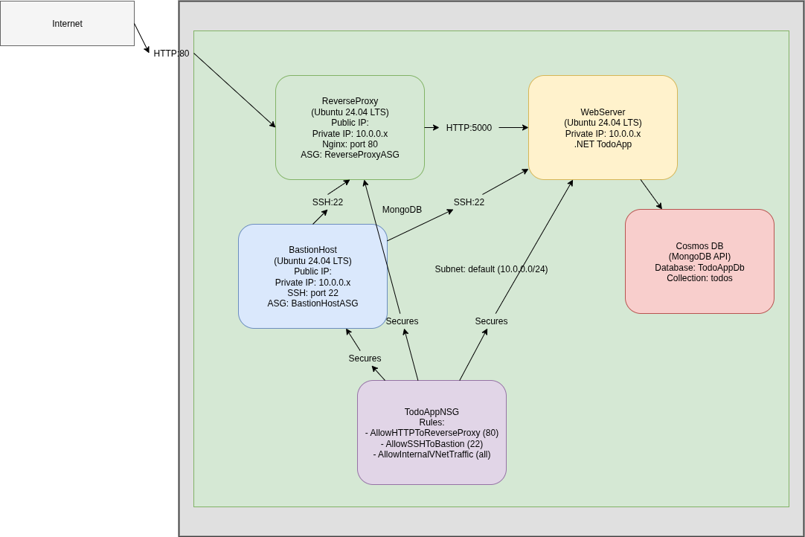
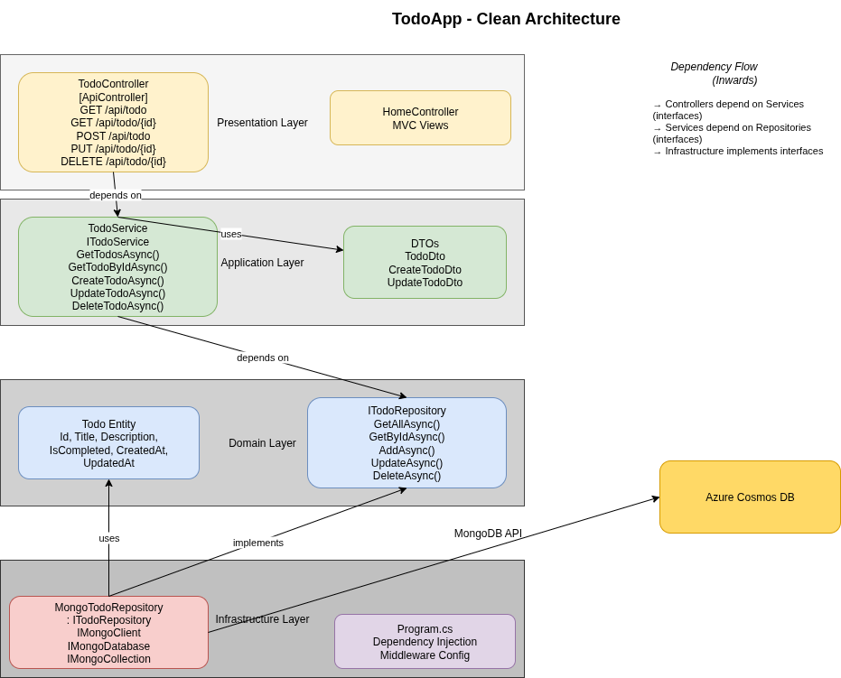

# "Inlämningsuppgift 2" Report

**Author:** Claes Fransson  
**Date:** March 24, 2026  
**Repository:** https://github.com/Claes1981/inlamningsuppgift2

---

## Table of Contents

1. [Introduction](#introduction)
2. [Architecture Design](#architecture-design)
3. [Security Measures](#security-measures)
4. [Azure Services Used](#azure-services-used)
5. [Infrastructure Provisioning](#infrastructure-provisioning)
6. [Application Deployment](#application-deployment)
7. [Verification Steps](#verification-steps)
8. [Completed vs. Pending Implementation](#completed-vs-pending-implementation)
9. [Conclusion](#conclusion)

---

## Introduction

The purpose of this assignment is to build a functional production environment for a web application using Azure cloud services. The application is a .NET 10.0 Todo application following Clean Architecture principles, deployed on a virtual server with proper security measures to protect against external threats.

This report describes the infrastructure design, security implementation, and step-by-step provisioning process using Infrastructure as Code (IaC) with Bicep templates and Bash automation scripts.

---

## Architecture Design

### Overview

The infrastructure consists of three Ubuntu 24.04 LTS virtual machines arranged in a secure topology:



### To-Do App Architecture

The .NET Todo application follows Clean Architecture principles with four distinct layers:



### Component Descriptions

| Component                  | Purpose                                                         | IP Configuration                  |
| -------------------------- | --------------------------------------------------------------- | --------------------------------- |
| **Reverse Proxy**          | Terminates public HTTP traffic, forwards requests to web server | Public IP + Private IP (10.0.0.4) |
| **Web Server**             | Hosts the .NET Todo application                                 | Private IP only (10.0.0.6)        |
| **Bastion Host**           | Secure SSH access to internal VMs                               | Public IP + Private IP (10.0.0.5) |
| **Cosmos DB**              | MongoDB-compatible NoSQL database                               | Azure PaaS service                |
| **Virtual Network**        | Isolated network (10.0.0.0/16) with single subnet               | 10.0.0.0/24                       |
| **Network Security Group** | Traffic filtering with Application Security Groups              | Subnet-level association          |

### Network Security Groups

The NSG implements the principle of least privilege with the following rules:

| Priority | Direction | Source           | Destination      | Port  | Protocol | Purpose                  |
| -------- | --------- | ---------------- | ---------------- | ----- | -------- | ------------------------ |
| 100      | Inbound   | Internet         | ReverseProxy ASG | 80    | TCP      | Public HTTP access       |
| 200      | Inbound   | Internet         | BastionHost ASG  | 22    | TCP      | SSH admin access         |
| 300      | Inbound   | ReverseProxy ASG | WebServer ASG    | 5000  | TCP      | Internal app traffic     |
| 400      | Inbound   | WebServer ASG    | Cosmos DB        | 10255 | TCP      | MongoDB protocol         |
| 500      | Inbound   | BastionHost ASG  | All VMs ASG      | 22    | TCP      | Internal SSH via bastion |

---

## Security Measures

### 1. Network Segmentation

- **Application Security Groups (ASGs)** are used to logically group VMs by function, enabling flexible and maintainable NSG rules
- **Private Web Server** - The application server has no public IP, making it inaccessible from the internet directly
- **Single Subnet** - All VMs reside in 10.0.0.0/24, with NSG rules controlling all traffic

### 2. Access Control

- **SSH Key Authentication Only** - Password authentication is disabled on all VMs
- **Bastion Host Pattern** - All administrative SSH access must go through the bastion host
- **ProxyJump Configuration** - Internal VMs are only reachable via: `ssh -o ProxyJump="azureuser@<bastion_ip>" azureuser@<internal_ip>`

### 3. Infrastructure Security

- **Cloud-init Scripts** - Automated, reproducible VM configuration without manual intervention
- **No Hardcoded Secrets** - Cosmos DB credentials are retrieved dynamically during deployment
- **NSG at Subnet Level** - Centralized traffic control for all VMs in the subnet

### 4. Application Security

- **Input Validation** - DTOs use DataAnnotations for validation (required fields, string length limits)
- **Result Pattern** - Error handling without exceptions for better performance
- **Dependency Injection** - Loose coupling between layers following Clean Architecture
- **HTTPS Ready** - NGINX reverse proxy configured for future SSL/TLS termination

### 5. Database Security

- **Cosmos DB Network Rules** - Database only accessible from web server subnet
- **Serverless Tier** - Cost-effective with automatic scaling
- **MongoDB API** - Familiar driver ecosystem with Azure's reliability

---

## Azure Services Used

| Service                         | Purpose              | Configuration                                    |
| ------------------------------- | -------------------- | ------------------------------------------------ |
| **Virtual Machines**            | Application hosting  | Ubuntu 24.04 LTS, Standard_DS1_v2                |
| **Virtual Network**             | Network isolation    | 10.0.0.0/16                                      |
| **Network Security Group**      | Traffic filtering    | Subnet-level with ASGs                           |
| **Public IP Addresses**         | External access      | Standard SKU, Static                             |
| **Application Security Groups** | Traffic segmentation | ReverseProxy, WebServer, BastionHost, AllVMs     |
| **Cosmos DB**                   | Data persistence     | MongoDB API, Serverless tier, 4.2 server version |
| **Managed Disks**               | VM storage           | Standard SSD                                     |

---

## Infrastructure Provisioning

### Tools and Technologies

| Tool               | Purpose                                    |
| ------------------ | ------------------------------------------ |
| **Azure CLI (az)** | Authentication and resource management     |
| **Bicep**          | Infrastructure as Code for Azure resources |
| **Bash 4.0+**      | Automation scripts for provisioning        |
| **Cloud-init**     | VM configuration during first boot         |
| **NGINX**          | Reverse proxy                              |

### Step-by-Step Provisioning

#### Step 1: Prerequisites Verification

```bash
# Verify Azure CLI is installed and logged in
az --version
az account show

# Verify Bicep CLI is installed
az bicep version

# Verify SSH key exists
cat ~/.ssh/id_rsa.pub
```

**Expected Output:** Azure account details and SSH public key content.

#### Step 2: Validate Bicep Template

```bash
az bicep build --file infra/infrastructure.bicep
```

**Expected Output:** `Generated infrastructure.json` (no errors).

#### Step 3: Run Provisioning Script

```bash
chmod +x infra/provisioning.sh
./infra/provisioning.sh
```

The script performs the following operations:

1. **Creates Resource Group** in `denmarkeast` region
2. **Provisions Bicep Template** which provisions:
   - Virtual Network (10.0.0.0/16) with subnet (10.0.0.0/24)
   - Network Security Group with ASG-based rules
   - Three Application Security Groups (ReverseProxy, WebServer, BastionHost)
   - Two Public IP addresses (Reverse Proxy and Bastion Host)
   - Three Virtual Machines with cloud-init configurations
   - Cosmos DB account with MongoDB API
   - MongoDB database (`TodoAppDb`) and collection (`todos`)
3. **Outputs Resource Information** to `/tmp/provisioning_outputs.json`

**Verification:**

```bash
# Check resource group exists
az group show --name TodoAppResourceGroup --query name

# List all VMs
az vm list --resource-group TodoAppResourceGroup --query "[].name"

# Check Cosmos DB account
az cosmosdb show --name claestodoappdbaccount --resource-group TodoAppResourceGroup --query name
```

#### Step 4: Verify VM Connectivity

```bash
# Test bastion host SSH access
ssh azureuser@<bastion_public_ip> "echo 'Bastion host accessible'"

# Test internal web server via bastion
ssh -o ProxyJump="azureuser@<bastion_public_ip>" azureuser@10.0.0.6 "echo 'Web server accessible'"

# Test reverse proxy health endpoint
curl http://<reverse_proxy_public_ip>/health
```

**Expected Output:** `OK` from health endpoint.

---

## Application Deployment

### CI/CD Pipeline with GitHub Actions

The application deployment is automated using GitHub Actions. The workflow is triggered on every push to the `main` branch or manually via workflow dispatch.

#### Workflow Overview

The GitHub Actions workflow (`.github/workflows/dotnet-desktop.yml`) consists of two jobs:

1. **Build Job** (runs on GitHub-hosted Ubuntu runner):
   
   - Installs .NET 10.0 SDK
   - Restores NuGet dependencies
   - Builds and publishes the application
   - Uploads artifacts to GitHub

2. **Deploy Job** (runs on self-hosted runner on Bastion Host):
   
   - Downloads artifacts from build job
   - Stops the application service
   - Deploys new version to `/opt/GithubActionsTodoApp`
   - Starts the application service

#### Web Server Configuration

The web server is configured via cloud-init (`infra/cloud-init_webserver.sh`) to:

1. Install .NET 10.0 Runtime
2. Create systemd service `GithubActionsTodoApp.service`
3. Enable service to start on boot
4. Configure firewall to allow port 5000

The systemd service configuration:

```ini
[Unit]
Description=ASP.NET Web App running on Ubuntu

[Service]
WorkingDirectory=/opt/GithubActionsTodoApp
ExecStart=/usr/bin/dotnet /opt/GithubActionsTodoApp/GithubActionsTodoApp.dll
Restart=always
RestartSec=10
KillSignal=SIGINT
SyslogIdentifier=GithubActionsTodoApp
User=www-data
Environment=ASPNETCORE_ENVIRONMENT=Production
Environment=DOTNET_PRINT_TELEMETRY_MESSAGE=false
Environment="ASPNETCORE_URLS=http://*:5000"

[Install]
WantedBy=multi-user.target
```

#### Manual Deployment Alternative

For manual deployment without GitHub Actions:

1. **Build and Publish Locally**
   
   ```bash
   dotnet publish -c Release -o ./publish
   ```

2. **Create Production Configuration**
   
   ```bash
   PRIMARY_KEY=$(az cosmosdb list-keys --name claestodoappdbaccount --resource-group TodoAppResourceGroup --query primaryMasterKey -o tsv)
   
   cat > ./publish/appsettings.Production.json << EOF
   {
     "MongoSettings": {
       "ConnectionString": "mongodb+srv://claestodoappdbaccount.mongo.cosmos.azure.com:10255/?ssl=true&replicaSet=globaldb&authSource=admin&authMechanism=SCRAM-SHA-256&password=${PRIMARY_KEY}",
       "DatabaseName": "TodoAppDb",
       "CollectionName": "todos"
     }
   }
   EOF
   ```

3. **Transfer to Web Server via Bastion**
   
   ```bash
   ssh -o ProxyJump="azureuser@<bastion_ip>" azureuser@10.0.0.6 << 'EOF'
   sudo systemctl stop GithubActionsTodoApp.service
   sudo rm -Rf /opt/GithubActionsTodoApp
   EOF
   
   scp -o ProxyJump="azureuser@<bastion_ip>" ./publish/* azureuser@10.0.0.6:/tmp/todoapp/
   
   ssh -o ProxyJump="azureuser@<bastion_ip>" azureuser@10.0.0.6 << 'EOF'
   sudo mv /tmp/todoapp /opt/GithubActionsTodoApp
   sudo chown -R www-data:www-data /opt/GithubActionsTodoApp
   sudo systemctl start GithubActionsTodoApp.service
   EOF
   ```

### Verification

```bash
# Check service status
ssh -o ProxyJump="azureuser@<bastion_ip>" azureuser@10.0.0.6 "sudo systemctl status GithubActionsTodoApp"

# View application logs
ssh -o ProxyJump="azureuser@<bastion_ip>" azureuser@10.0.0.6 "sudo journalctl -u GithubActionsTodoApp -f"

# Test API endpoint through reverse proxy
curl http://<reverse_proxy_public_ip>/api/todo

# Test Swagger UI
curl http://<reverse_proxy_public_ip>/swagger

# Test health endpoint
curl http://<reverse_proxy_public_ip>/health
```

---

## Verification Steps

| Step              | Command                                                                                           | Expected Result                 |
| ----------------- | ------------------------------------------------------------------------------------------------- | ------------------------------- |
| 1. Resource Group | `az group show --name TodoAppResourceGroup`                                                       | Returns resource group details  |
| 2. VMs Running    | `az vm list --resource-group TodoAppResourceGroup --query "[].{name:name,powerState:powerState}"` | All 3 VMs in `VM running` state |
| 3. Bastion SSH    | `ssh azureuser@<bastion_ip> "whoami"`                                                             | Returns `azureuser`             |
| 4. Reverse Proxy  | `curl http://<reverse_proxy_ip>/health`                                                           | Returns `OK`                    |
| 5. Cosmos DB      | `az cosmosdb show --name claestodoappdbaccount --resource-group TodoAppResourceGroup`             | Returns account details         |
| 6. NSG Rules      | `az network nsg rule list --resource-group TodoAppResourceGroup --nsg-name TodoAppNsg`            | Shows 5+ inbound rules          |

---

## Completed vs. Pending Implementation

### ✅ Completed

| Component                       | Status     | Notes                                        |
| ------------------------------- | ---------- | -------------------------------------------- |
| **Resource Group**              | ✅ Complete | `TodoAppResourceGroup` in `denmarkeast`      |
| **Virtual Network**             | ✅ Complete | 10.0.0.0/16 with subnet 10.0.0.0/24          |
| **Network Security Group**      | ✅ Complete | ASG-based rules implemented                  |
| **Application Security Groups** | ✅ Complete | ReverseProxy, WebServer, BastionHost, AllVMs |
| **Reverse Proxy VM**            | ✅ Complete | NGINX configured, health check working       |
| **Web Server VM**               | ✅ Complete | Systemd service configured for .NET app      |
| **Bastion Host VM**             | ✅ Complete | SSH access working                           |
| **Cosmos DB Account**           | ✅ Complete | MongoDB API, Serverless tier                 |
| **MongoDB Database**            | ✅ Complete | `TodoAppDb` created via Bicep                |
| **MongoDB Collection**          | ✅ Complete | `todos` with shard key `category`            |
| **Bicep Template**              | ✅ Complete | All resources provisioned via IaC            |
| **Provisioning Script**         | ✅ Complete | `provisioning.sh` with error handling        |
| **Cloud-init Scripts**          | ✅ Complete | Base64 encoded, embedded in Bicep            |
| **.NET Todo Application**       | ✅ Complete | Clean Architecture, 102 tests passing        |
| **Unit Tests**                  | ✅ Complete | xUnit, Moq, FluentAssertions                 |
| **Architecture Diagrams**       | ✅ Complete | Drawio files in `doc/` folder                |

### ⏳ Pending

| Component                  | Status             | Notes                                                             |
| -------------------------- | ------------------ | ----------------------------------------------------------------- |
| **Application Deployment** | ⏳ Not Yet Deployed | Application built but not deployed to web server                  |
| **End-to-End Testing**     | ⏳ Pending          | Requires deployed application                                     |
| **CI/CD Pipeline**         | ⏳ Partial          | GitHub Actions workflow exists, self-hosted runner not configured |

---

## Conclusion

This assignment demonstrates a complete cloud infrastructure implementation following security best practices and Infrastructure as Code principles. The architecture uses the bastion host pattern for secure administrative access, application security groups for maintainable network rules, and a reverse proxy for public-facing traffic.

The .NET Todo application follows Clean Architecture with proper separation of concerns, comprehensive testing (102 tests), and input validation. All infrastructure is provisioned through Bicep templates, ensuring reproducibility and version control.

### Key Achievements

1. **Security First Design** - Private application server, SSH via bastion, NSG with least privilege
2. **Infrastructure as Code** - 100% of Azure resources defined in Bicep
3. **Automation** - Bash scripts for provisioning and deployment
4. **Clean Architecture** - Separation of Domain, Application, Infrastructure, and Presentation layers
5. **Test Coverage** - Comprehensive unit tests with FluentAssertions

---

## Development tools

- Qwen3.5-27B Large Language Model
- Llama.cpp
- Opencode/Roo Code/Pi Coding Agent
- VSCodium

## References

- [Azure Bicep Documentation](https://learn.microsoft.com/azure/azure-resource-manager/bicep/)
- [Azure Cosmos DB MongoDB API](https://learn.microsoft.com/azure/cosmos-db/mongodb/)
- [.NET Clean Architecture](https://cleanarchitecturedotnet.com/)
- [Ubuntu Cloud-init](https://cloud-init.io/)
